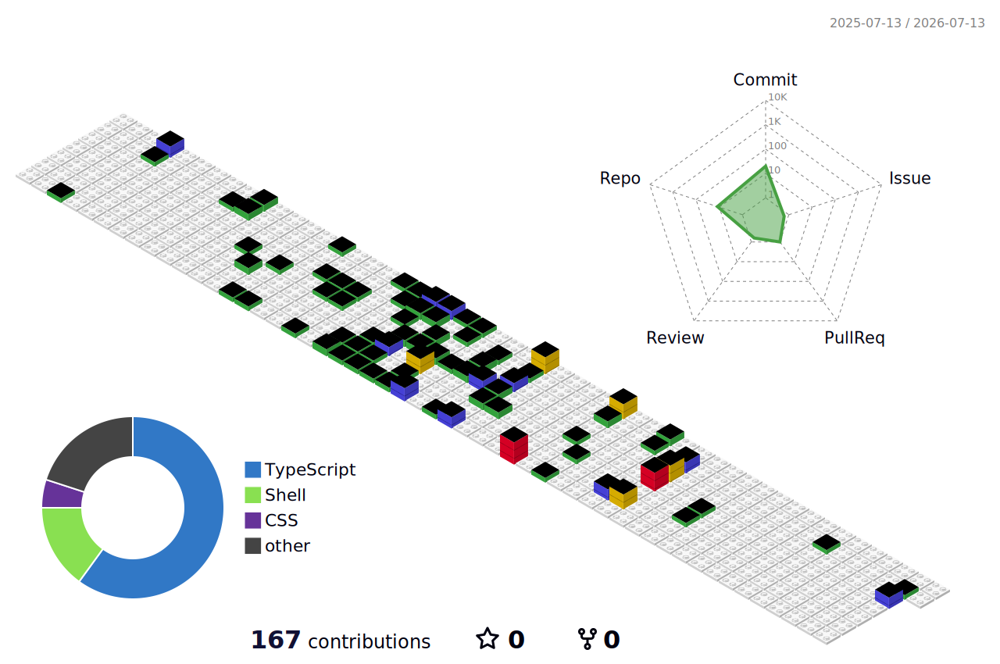

<div align="center">


</div>

---

## 👨‍💻 About Me

> **"팀의 개발 효율과 협업 품질을 높여 사용자 경험을 개선하는 개발자"**

```typescript
const developer = {
  name: "Hyunmin Park",
  role: "Frontend Developer",
  experience: "6 years",
  location: "Seoul, South Korea",
  core: ["React", "TypeScript", "JavaScript"],
};
```

React·TypeScript 기반으로 개발해 온 6년차 프론트엔드 개발자입니다.

- 🎯 단순한 기능 구현을 넘어, **사용자 입장에서 설계하고 개발하는 것**을 지향합니다.
- 🌱 혼자 빨리 가는 것보다 **꾸준히 좋은 속도를 낼 수 있는 구조**를 만드는 일을 중요하게 생각합니다.

---

## 🛠 Tech Stack

### Core
   

### State / Data
  

### Styling
  

### Testing
 

### Infra / Tooling
      

---

## 📊 GitHub Stats

<div align="center">


</div>

<div align="center">


</div>

<div align="center">


</div>

---

## 📅 3D Contribution Calendar

<div align="center">

<!-- profile-3d.yml 워크플로우를 설정하고 실행하면 아래 이미지가 저장소에 생성됩니다. 설정 방법은 파일 하단 주석 참고 -->
<!-- 다른 스타일을 원하면 파일명만 바꾸세요 (예: profile-green-animate / profile-night-rainbow / profile-gitblock) -->

</div>

---

## 🔗 Connect With Me

<div align="center">

[](https://dangboo.kr)
[](https://velog.io/@ethnos/posts)
[](mailto:badagogi@gmail.com)

</div>

---

<div align="center">


⭐️ From [windstar20](https://github.com/windstar20)

</div>
